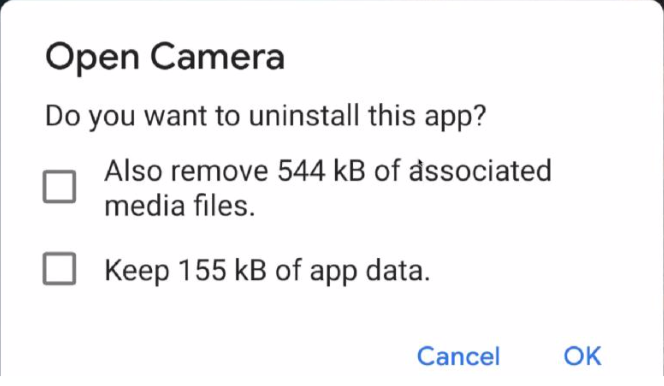

Android P,Q 版本适配常见问题

项目地址 <https://github.com/huangyuanlove/AdaptationAndroidP>

#### 文件操作(FileOperationActivity)
先看几个常用的文件路径，这里说明一下，应用的id是`com.huangyuanlove.adaptationhighversion`

* **getFilesDir()**

  得到的路径是 `/data/user/0/com.huangyuanlove.adaptationhighversion/files`,读写该文件夹下的文件**不需要**申请文件读写权限。卸载应用时**会被删除**。对用户**不可见**，我们在AndroidStudio中使用`Device File Explorer`查看是在`/data/data/com.huangyuanlove.adaptationhighversion/files`

* **getCacheDir()**
  得到的路径是`/data/user/0/com.huangyuanlove.adaptationhighversion/cache`，读写该文件夹下的文件**不需要**申请文件读写权限。卸载应用时**会被删除**。对用户**不可见**，我们在AndroidStudio中使用`Device File Explorer`查看是在`/data/data/com.huangyuanlove.adaptationhighversion/cache`

* getExternalCacheDir()

  得到的路径是`/storage/emulated/0/Android/data/com.huangyuanlove.adaptationhighversion/cache`

  读写该文件夹下的文件**不需要**申请文件读写权限。卸载应用时**会被删除**。对用户**可见**，无法使用`Device File Explorer`查看，因为`/storage/emulated`下的文件没有操作权限，可以用过`adb shell`切换进去查看，路径为`/storage/emulated/0/Android/data/com.huangyuanlove.adaptationhighversion/cache`。用户使用手机的文件管理器查看时路径为`/Android/data/com.huangyuanlove.adaptationhighversion/cache`

* getExternalFilesDir(null)

  得到的路径是`/storage/emulated/0/Android/data/com.huangyuanlove.adaptationhighversion/files`,

  读写该文件夹下的文件**不需要**申请文件读写权限。卸载应用时**会被删除**。对用户**可见**，无法使用`Device File Explorer`查看，因为`/storage/emulated`下的文件没有操作权限，可以用过`adb shell`切换进去查看，路径为`/storage/emulated/0/Android/data/com.huangyuanlove.adaptationhighversion/file`。用户使用手机的文件管理器查看时路径为`/Android/data/com.huangyuanlove.adaptationhighversion/file`

* Environment.getExternalStorageDirectory();

  得到的路径是`/storage/emulated/0`

  读写该文件夹下的文件**需要**申请文件读写权限。卸载应用时不会被删除。对用户**可见**，也就是外部存储的根路径。

* Environment.getExternalStoragePublicDirectory(Environment.DIRECTORY_DOWNLOADS);

  得到的路径是`/storage/emulated/0/Download`

  该方法的参数可以查看`Environment`类来详细了解。读写该文件夹下的文件**不需要**申请文件读写权限。卸载应用时不会被删除。对用户可以，上述就是外部存储根路径下的Download文件夹。

P版本应用在sd卡根目录保存的应用数据卸载时不会被清除，但是Q版本这部分数据实际保存的是应用的沙箱目录 下，卸载的时候回全部被清除;
应用不想卸载删除的文件通过SAF或者是MediaProvider的接口保存在公共目录，不要放在应用的沙箱目录，公共目录文件卸载删除默认会弹框提示，对应弹框的第一 个勾选，默认保留，勾选删除，**谷歌后续的版本计划把这 个勾选去掉，意味着应用保存到公共集合目录的文件卸载 的时候不会提示用户删除**;
对于应用的沙箱文件，应用如果不想卸载的时候被删除，需要应用在manifest文件增加:<application android:fragileUserData="true" />，这样卸载应用的时候，系统弹出的对话框中才会有第二个勾选框出现(不增加该属性是不会有第二个勾选出现)，默认删除，勾选保留。




#### 拍照、选择图片(TakePhotoOrChoosePhotoActivity)

在Android6.0动态申请权限，Android7.0严格模式之后，拍照出现了问题，要么是没有权限存储图片，要么是返回的uri是空的，或者抛出如下异常：

``` java
android.os.FileUriExposedException: file:///storage/emulated/0/test.txt exposed beyond app through Intent.getData()
java.lang.SecurityException: Permission Denial: reading com.android.providers.media.MediaProvider uri
```

出现上面的问题是因为Android7.0提高私有目录的安全性，防止应用信息的泄漏，从 Android 7.0 开始，应用私有目录的访问权限被做限制。具体表现为，开发人员不能够再简单地通过 file:// URI 访问其他应用的私有目录文件或者让其他应用访问自己的私有目录文件。对于面向 Android 7.0 的应用，Android 框架执行的 StrictMode API 政策禁止在您的应用外部公开 file:// URI。如果一项包含文件 URI 的 intent 离开您的应用，则应用出现故障，并出现 FileUriExposedException 异常。

我们可以通过配置FileProvider方式来避免这种问题。

配置方式网上一堆，这里不再抄一遍了：

<https://www.jianshu.com/p/ac5fe346a5b7>

<https://www.jianshu.com/p/121bbb07cb07>

在项目中

``` java
 //指定Uri，拍照返回的data为空
String tempImagePath = getFilesDir().getPath();
tempImageFile = File.createTempFile("image_", ".jpg", new File(tempImagePath));
Intent intent = new Intent(MediaStore.ACTION_IMAGE_CAPTURE);

if (Build.VERSION.SDK_INT >= 24) {
  intent.addFlags(Intent.FLAG_GRANT_READ_URI_PERMISSION);
  intent.putExtra(MediaStore.EXTRA_OUTPUT,
  FileProvider.getUriForFile(TakePhotoOrChoosePhotoActivity.this,
                                        "com.huangyuanlove.adaptationhighversion.fileprovider", tempImageFile));
} else {
  intent.putExtra(MediaStore.EXTRA_OUTPUT, Uri.fromFile(tempImageFile));
}
startActivityForResult(intent, TAKE_PHOTO_CODE);
```

当拍照返回之后

``` java
  bitmap = BitmapFactory.decodeFile(tempImageFile.getPath());
  showImage.setImageBitmap(bitmap);
```

选择图片的时候：

``` java
Intent albumIntent = new Intent(Intent.ACTION_PICK);
albumIntent.setDataAndType(MediaStore.Images.Media.EXTERNAL_CONTENT_URI, "image/*");
startActivityForResult(albumIntent, CHOOSE_PHOTO_CODE);
```

选择图片返回的时候

``` java
if (data != null) {
  Uri selectedImage = data.getData();
  String[] filePathColumn = {MediaStore.Images.Media.DATA};

  Cursor cursor = getContentResolver().query(selectedImage,
                                             filePathColumn, null, null, null);
  cursor.moveToFirst();
  int columnIndex = cursor.getColumnIndex(filePathColumn[0]);
  String picturePath = cursor.getString(columnIndex);
  cursor.close();

  bitmap = BitmapFactory.decodeFile(picturePath);
  showImage.setImageBitmap(bitmap);
}
```

#### 存储访问框架(SAFActivity)

官方有最佳实践：<https://developer.android.com/guide/topics/providers/document-provider?hl=zh-cn>

#### 通知管理(NotificationActivity)

主要是8.0之后的NotificationChannel问题，可以参考这个 

<http://blog.huangyuanlove.com/2018/12/27/Android-O-%E9%80%82%E9%85%8DNotificationChannel/>

#### 权限申请(MainActivity)

6.0之后的动态权限申请问题。大部分应用是在基类中一次性申请所有可能用到的权限，而不关心当前界面是否需要这个权限。

比如应用中需要用到相机、访问存储空间、读写通讯录、录音权限，则在BaseActivity中去申请这四种高危权限，这种做法对开发人员来说比较简单粗暴，不需要关心每次点击事件是否有权限。但对于用户来讲，刚打开应用就申请这么多权限，体验是不好的。推荐做法还是在需要时去申请权限。

比如更换头像时，点击按钮之后才会去申请相机权限，而不是打开资料设置界面的时候去申请。并且建议只申请用到的权限，而不是一次性全部申请。

这里需要注意的是，国产手机中对于权限的判定和在设置里面看到的权限可能不一致。

1. 当我们点击了拍照按钮之后，首先检查权限：

   ``` java
   checkSelfPermission(Manifest.permission.CAMERA) == PackageManager.PERMISSION_GRANTED
   ```

   这里需要判断一下版本，大于6.0(Build.VERSION.SDK_INT >= Build.VERSION_CODES.M)才需要去判断。

   有权限直接到拍照界面，没有权限则申请权限：

2. 申请权限

   ``` java
   requestPermissions(new String[]{Manifest.permission.CAMERA}, REQUEST_PERMISSION_CAMERA);
   ```

3. 权限申请返回结果

   ``` java
      
   @RequiresApi(api = Build.VERSION_CODES.M)
   @Override
   public void onRequestPermissionsResult(int requestCode, @NonNull String[] permissions, @NonNull int[] grantResults) {
     super.onRequestPermissionsResult(requestCode, permissions, grantResults);
     if (permissions.length <= 0 || grantResults.length <= 0) {
       return;
     }
     switch (requestCode) {
       case REQUEST_PERMISSION_CAMERA:
         final String permission = permissions[0];
   
         if (grantResults.length > 0 && grantResults[0] ==
       			PackageManager.PERMISSION_GRANTED) {
           Toast.makeText(MainActivity.this, "授予拍照权限成功", Toast.LENGTH_SHORT).show();
         } else {
           if (shouldShowRequestPermissionRationale(permissions[0])) {
             //用户只点击了禁止，没有选择不再提示
             Toast.makeText(MainActivity.this, "用户禁止了" + permission + "权限", Toast.LENGTH_SHORT).show();
           } else {
             //解释原因，并且引导用户至设置页手动授权
             new AlertDialog.Builder(this)
               .setMessage("【用户选择了不在提示按钮，或者系统默认不在提示（如MIUI）。" +
                           "引导用户到应用设置页去手动授权,注意提示用户具体需要哪些权限】\r\n" +
                           "获取相关权限失败:xxxxxx,将导致部分功能无法正常使用，需要到设置页面手动授权")
               .setPositiveButton("去授权", new DialogInterface.OnClickListener() {
                 @Override
                 public void onClick(DialogInterface dialog, int which) {
                   //引导用户至设置页手动授权
                   Intent intent = new Intent(Settings.ACTION_APPLICATION_DETAILS_SETTINGS);
                   Uri uri = Uri.fromParts("package", getApplicationContext().getPackageName(), null);
                   intent.setData(uri);
                   startActivity(intent);
                 }
               })
               .setNegativeButton("取消", new DialogInterface.OnClickListener() {
                 @Override
                 public void onClick(DialogInterface dialog, int which) {
                   //引导用户手动授权，权限请求失败
                   Toast.makeText(MainActivity.this, "引导授权失败:" + permission, Toast.LENGTH_LONG).show();
                 }
               }).setOnCancelListener(new DialogInterface.OnCancelListener() {
               @Override
               public void onCancel(DialogInterface dialog) {
                 //引导用户手动授权，权限请求失败
                 Toast.makeText(MainActivity.this, "引导授权失败:" + permission, Toast.LENGTH_LONG).show();
               }
             }).show();
           }
         }
   
         break;
       default:
         break;
     }
   }
   ```

   这里需要注意的是，官方文档说第一申请权限的时候不会有"禁止后不再询问"的复选框，但是在很多国内rom上第一次就会有这个提示。当用户勾选了"禁止后不再询问"，这时候我们申请权限会立刻调用`onRequestPermissionsResult`方法，并且`shouldShowRequestPermissionRationale`返回false。这时候我们需要引导用户到设置界面开启权限。

#### 快捷方式(ShortCutActivity)

Android 7.1之后提供了快捷方式的API，在长按应用图标后会弹出定义的快捷方式(个数有限)。但在国产rom中有可能会把这个功能干掉。

快捷方式有分为动态注册和静态注册(配置文件)，动态注册的快捷方式可以动态删除，静态注册的快捷方式不可动态删除。

1. 静态注册

   在res文件夹下新建xml文件夹，在其中新建`shortcuts.xml`,内容如下：

   ``` xml
   <shortcuts xmlns:android="http://schemas.android.com/apk/res/android">
       <shortcut
           android:enabled="true"
           android:icon="@mipmap/ic_launcher_round"
           android:shortcutDisabledMessage="@string/permission_deny"
           android:shortcutId="camera"
           android:shortcutLongLabel="@string/take_photo_or_choose_image"
           android:shortcutShortLabel="@string/camera">
           <intent
               android:action="android.intent.action.VIEW"
               android:targetClass="com.huangyuanlove.adaptationhighversion.TakePhotoOrChoosePhotoActivity"
               android:targetPackage="com.huangyuanlove.adaptationhighversion" />
       </shortcut>
   
   
       <shortcut
           android:enabled="true"
           android:icon="@mipmap/ic_launcher_round"
           android:shortcutDisabledMessage="@string/permission_deny"
           android:shortcutId="about_file"
           android:shortcutLongLabel="@string/file_example"
           android:shortcutShortLabel="@string/file">
           <intent
               android:action="android.intent.action.VIEW"
               android:targetClass="com.huangyuanlove.adaptationhighversion.FileOperationActivity"
               android:targetPackage="com.huangyuanlove.adaptationhighversion" />
       </shortcut>
       <shortcut
           android:enabled="true"
           android:icon="@mipmap/ic_launcher_round"
           android:shortcutDisabledMessage="@string/permission_deny"
           android:shortcutId="notification_example"
           android:shortcutLongLabel="@string/notification_example"
           android:shortcutShortLabel="@string/notification">
           <intent
               android:action="android.intent.action.VIEW"
               android:targetClass="com.huangyuanlove.adaptationhighversion.NotificationActivity"
               android:targetPackage="com.huangyuanlove.adaptationhighversion" />
       </shortcut>
   
       <shortcut
           android:enabled="true"
           android:icon="@mipmap/ic_launcher_round"
           android:shortcutDisabledMessage="@string/permission_deny"
           android:shortcutId="saf_example"
           android:shortcutLongLabel="@string/saf_example"
           android:shortcutShortLabel="@string/saf">
           <intent
               android:action="android.intent.action.VIEW"
               android:targetClass="com.huangyuanlove.adaptationhighversion.SAFActivity"
               android:targetPackage="com.huangyuanlove.adaptationhighversion" />
       </shortcut>
   </shortcuts>
   ```

   这里需要注意的是`shortcutDisabledMessage`、`shortcutLongLabel`、`shortcutShortLabel`属性值只能使用引用，不能直接硬编码。`shortcutLongLabel`是在长按图标时弹出的快捷方式名称，`shortcutShortLabel`是讲该快捷方式拖放到桌面后显示的名称。`shortcutId`是该快捷方式的唯一标识符。

   然后在`AndroidManifest.xml`文件中配置一下，找到一个Activity，其`intent-filter`被设置为`android.intent.action.MAIN`和`android.intent.category.LAUNCHER`

   ``` xml
   <activity android:name=".MainActivity">
     <intent-filter>
       <action android:name="android.intent.action.MAIN" />
       <action android:name="android.intent.action.VIEW" />
   
       <category android:name="android.intent.category.LAUNCHER" />
     </intent-filter>
   
     <meta-data
                android:name="android.app.shortcuts"
                android:resource="@xml/shortcuts" />
   </activity>
   ```

2. 动态注册

算了，看代码吧

添加新的快捷方式

``` java
private void addShortcut() {
        if (Build.VERSION.SDK_INT >= Build.VERSION_CODES.N_MR1) {
            ShortcutManager shortcutManager = getSystemService(ShortcutManager.class);
            Intent intent = new Intent(ShortCutActivity.this,ShortCutActivity.class);
            intent.setAction(Intent.ACTION_VIEW);
            ShortcutInfo shortcut = new ShortcutInfo.Builder(ShortCutActivity.this, "shortcut")
                    .setIcon(Icon.createWithResource(this, R.mipmap.ic_launcher))
                    .setShortLabel( getString( R.string.shortcut))
                    .setLongLabel(getString(R.string.shortcut_example))
                    .setIntent(intent)
                    .build();
            shortcutManager.addDynamicShortcuts(Arrays.asList( new ShortcutInfo[]{ shortcut}));
        }
    }
```

更新快捷方式

``` java
private void updateShortcut() {
        if (Build.VERSION.SDK_INT >= Build.VERSION_CODES.N_MR1) {
            ShortcutManager shortcutManager = getSystemService(ShortcutManager.class);
            Intent intent = new Intent(ShortCutActivity.this,ShortCutActivity.class);
            intent.setAction(Intent.ACTION_VIEW);
            ShortcutInfo shortcut = new ShortcutInfo.Builder(ShortCutActivity.this, "shortcut")
                    .setIcon(Icon.createWithResource(this, R.mipmap.ic_launcher))
                    .setShortLabel( getString( R.string.shortcut) +"new")
                    .setLongLabel(getString(R.string.shortcut_example) +"new")
                    .setIntent(intent)
                    .build();
            shortcutManager.updateShortcuts(Arrays.asList( new ShortcutInfo[]{ shortcut}));
        }
    }
```

删除快捷方式

``` java
private void removeShortcut() {
        if (Build.VERSION.SDK_INT >= Build.VERSION_CODES.N_MR1) {
            ShortcutManager shortcutManager = getSystemService(ShortcutManager.class);

            //动态添加并且在桌面创建了快捷方式，删除之前，先disable一下.  或者判断
            List<ShortcutInfo> shortcutInfos = shortcutManager.getPinnedShortcuts();
            
            for(ShortcutInfo si : shortcutInfos){
                if(si.getId().equals("shortcut")){
                    shortcutManager.disableShortcuts(Arrays.asList(new String[]{"shortcut"}));
                }
            }
            shortcutManager.removeDynamicShortcuts(Arrays.asList(new String[]{"shortcut"}));

            Toast.makeText(ShortCutActivity.this,"共" + shortcutInfos.size() +"个桌面快捷方式",Toast.LENGTH_SHORT).show();

        }
    }
```

被添加到桌面的快捷方式无法删除(可以从长按菜单中删除，但是桌面上图标无法删除，依然有效)，所以我们需要先查询一个桌面快捷方式有没有我们要删除的，如果有，先设置为不可以，由用户手动删除。设置为不可用时可以添加点击提示语(disableShortcuts的重载方法)

